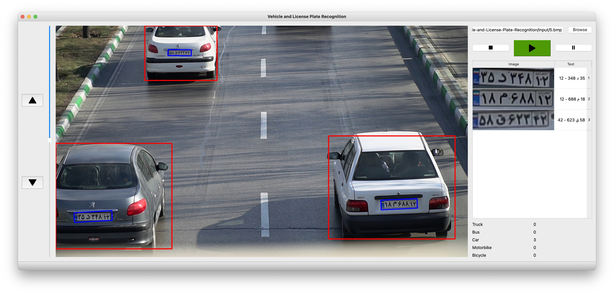

# Vehicle and License Plate Recognition
Deep Learning based Persian License Plate Detection and OCR

## Reference
- YOLOv3 multi-type vehicles Detecting: https://github.com/wsh122333/Multi-type_vehicles_flow_statistics
- SORT algorithm for tracking: https://github.com/abewley/sort
- EAST text detector fot plate detection: https://github.com/argman/EAST 



## installation
Python >= 3.6.0 required with all requirements.txt dependencies installed:
```
pip install -r requirements.txt
```
Build lanms
```
cd lanms
make
```
Download pretrained models from [GoogleDrive](https://drive.google.com/drive/folders/1fGap3iOAfSTJ8aDaci2DmNHb1KezPxMd?usp=sharing)

## Inference
Run following command for process image in command line interface mode:
```
python inference_image.py -i input/1.bmp
```

Run following command for process image in graphical user interface mode:
```
python inference_gui.py
```

## ToDo list
- [x] ocr
- [x] gui
- [x] tracker
- [ ] video processing
- [ ] time optimization
- [ ] memory optimization
- [ ] train source code
